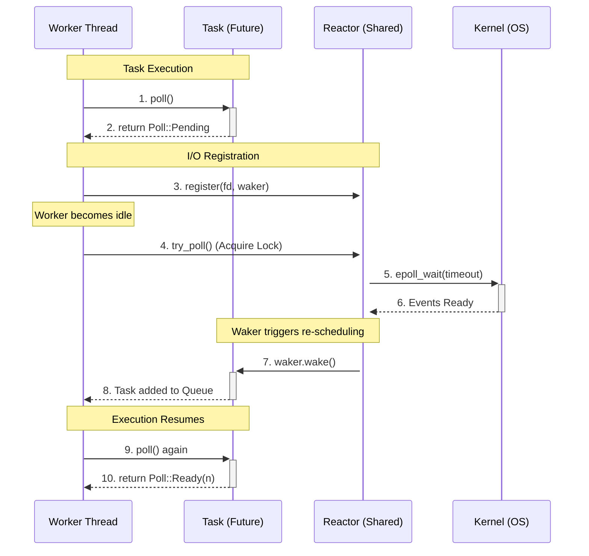
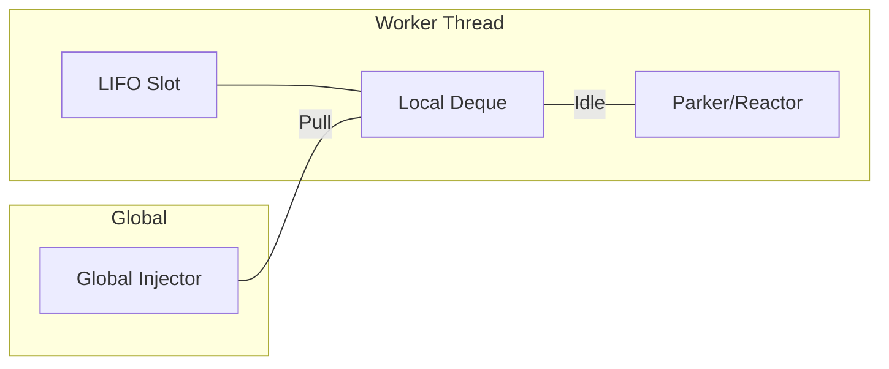
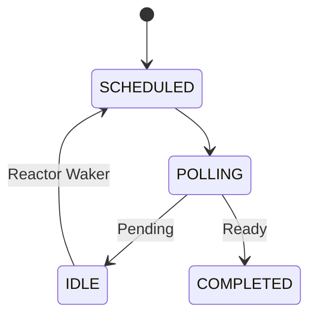

# Async Runtime

Implementation of a high-performance, work-stealing asynchronous executor and reactor in Rust.

## Architecture

The system utilizes a worker-driven reactor model (similar to Tokio/mio). There is no dedicated reactor thread; instead, worker threads drive the I/O event loop themselves when they run out of scheduled tasks.

### 1. Request Lifecycle Overview

The following sequence documents how a worker thread transitions from task execution to reactor polling when idle.

### 2. Task Scheduling & Work Stealing

Tasks are distributed via a multi-level queue hierarchy to minimize contention:
- **LIFO Slot**: A single-task "hot" slot for the most recently woken task (zero-latency).
- **Local Deque**: A per-worker FIFO/LIFO queue for thread-local tasks.
- **Global Injector**: A shared lock-free queue for tasks spawned from outside the runtime.

### 3. State Management

Task coordination is handled via an `AtomicU8` state machine, ensuring safe transitions between scheduling, polling, and completion.

## Performance Data

Benchmarks measured using `cargo run --release` with 1024-byte payloads on MacOS. The transition to **Inline Worker Polling** resolved the previous 130 MiB/s single-threaded bottleneck.

| Concurrency | Total Messages | Throughput (MiB/s) | vs. Tokio |
| :--- | :--- | :--- | :--- |
| **100** | 500,000 | **165.96** | **1.01x** |
| **500** | 100,000 | **160.06** | **1.00x** |
| **1,000** | 100,000 | **142.74** | **0.91x** |
| **10,000** | 1,000,000 | **84.18** | **0.69x** |

### Latency Optimization
At 100 concurrency, the custom runtime achieves a **P95 Latency of 623 µs**, outperforming Tokio's 775 µs in the same environment. This is attributed to the low-overhead LIFO slot and zero-allocation task pooling.

## Implementation Details

- **Reactor**: Mutex-protected state driven by idle workers via `try_lock/epoll_wait`.
- **Memory**: Future allocation via Power-of-Two `SegQueue` buckets (Thread-Local + Global).
- **Timers**: Hashed wheel implementation with $O(1)$ complexity.
- **I/O**: Level-triggered multiplexing via the `polling` crate.
