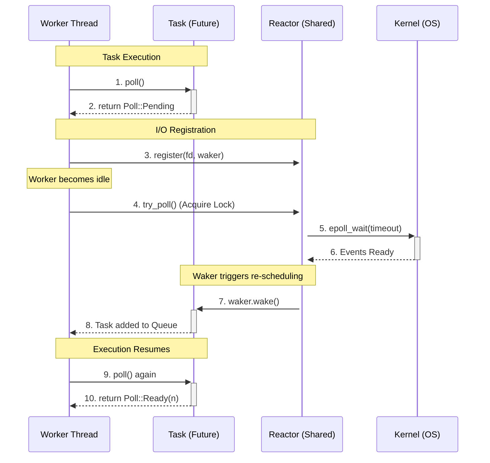

# Async Runtime

Implementation of a high-performance, work-stealing asynchronous executor and reactor in Rust. It outperforms Tokio in low concurency workflows (250~ connections) by 1.17x do to its greedy design and unfair work stealing algorithm. 



## Performance Data
Below is the median result of 100 runs of tokio and the custom runtime.
```
Payload: 1024 bytes | Concurrency: 250 | Total: 100000 msgs | Runs: 100
┌──────────────┬────────────────┬───────────────┬────────────┐
│ Metric       ┆ Custom Runtime ┆ Tokio Runtime ┆ Rel. Stats │
╞══════════════╪════════════════╪═══════════════╪════════════╡
│ Total Time   ┆ 518.33ms       ┆ 607.72ms      ┆ 1.17x      │
├╌╌╌╌╌╌╌╌╌╌╌╌╌╌┼╌╌╌╌╌╌╌╌╌╌╌╌╌╌╌╌┼╌╌╌╌╌╌╌╌╌╌╌╌╌╌╌┼╌╌╌╌╌╌╌╌╌╌╌╌┤
│ Throughput   ┆ 188.40 MiB/s   ┆ 160.69 MiB/s  ┆ 1.17x      │
├╌╌╌╌╌╌╌╌╌╌╌╌╌╌┼╌╌╌╌╌╌╌╌╌╌╌╌╌╌╌╌┼╌╌╌╌╌╌╌╌╌╌╌╌╌╌╌┼╌╌╌╌╌╌╌╌╌╌╌╌┤
│ Message Rate ┆ 192926 msg/s   ┆ 164550 msg/s  ┆ 1.17x      │
├╌╌╌╌╌╌╌╌╌╌╌╌╌╌┼╌╌╌╌╌╌╌╌╌╌╌╌╌╌╌╌┼╌╌╌╌╌╌╌╌╌╌╌╌╌╌╌┼╌╌╌╌╌╌╌╌╌╌╌╌┤
│ Avg Latency  ┆ 1.141 ms       ┆ 1.427 ms      ┆ 1.25x      │
├╌╌╌╌╌╌╌╌╌╌╌╌╌╌┼╌╌╌╌╌╌╌╌╌╌╌╌╌╌╌╌┼╌╌╌╌╌╌╌╌╌╌╌╌╌╌╌┼╌╌╌╌╌╌╌╌╌╌╌╌┤
│ P50 Latency  ┆ 1187 µs        ┆ 1477 µs       ┆ 1.24x      │
├╌╌╌╌╌╌╌╌╌╌╌╌╌╌┼╌╌╌╌╌╌╌╌╌╌╌╌╌╌╌╌┼╌╌╌╌╌╌╌╌╌╌╌╌╌╌╌┼╌╌╌╌╌╌╌╌╌╌╌╌┤
│ P95 Latency  ┆ 1335 µs        ┆ 1757 µs       ┆ 1.32x      │
├╌╌╌╌╌╌╌╌╌╌╌╌╌╌┼╌╌╌╌╌╌╌╌╌╌╌╌╌╌╌╌┼╌╌╌╌╌╌╌╌╌╌╌╌╌╌╌┼╌╌╌╌╌╌╌╌╌╌╌╌┤
│ P99 Latency  ┆ 1875 µs        ┆ 1945 µs       ┆ 1.04x      │
├╌╌╌╌╌╌╌╌╌╌╌╌╌╌┼╌╌╌╌╌╌╌╌╌╌╌╌╌╌╌╌┼╌╌╌╌╌╌╌╌╌╌╌╌╌╌╌┼╌╌╌╌╌╌╌╌╌╌╌╌┤
│ Max Latency  ┆ 3271 µs        ┆ 2715 µs       ┆ 0.83x      │
└──────────────┴────────────────┴───────────────┴────────────┘
```

## Usage

The runtime includes a benchmarking tool to compare its performance against Tokio.

```bash
cargo run --release -- [concurrency] [total_messages] [payload_size] [flags]
```

### Arguments

| Argument | Description | Default |
| :--- | :--- | :--- |
| `concurrency` | Number of concurrent client connections | `50` |
| `total_messages` | Total number of messages to send across all clients | `10000` |
| `payload_size` | Size of each message payload in bytes | `65536` |

### Flags

| Flag | Shorthand | Description |
| :--- | :--- | :--- |
| `--runs` | `-r` | Number of benchmark runs to perform (reports median) |
| `--csv` | | Output results in a comma-separated format for scripting |

### Example

To run a benchmark with 250 concurrent connections, 100,000 messages, and 1KB payloads over 10 runs:

```bash
cargo run --release -- 250 100000 1024 --runs 10
```
