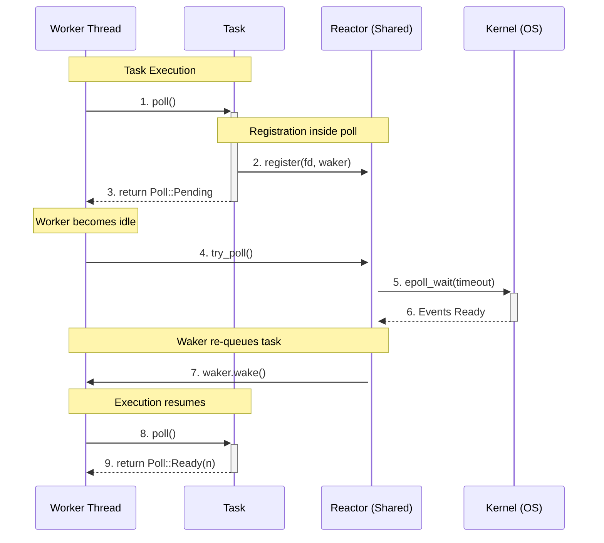

# Async Runtime

Implementation of a high-performance, work-stealing asynchronous executor and reactor in Rust. It outperforms Tokio in low concurrency workflows (250~ connections) by 1.36x due to its greedy design and unfair work stealing algorithm. 



## Performance Data
Below is the median result of 100 runs of tokio and the custom runtime.
```
Payload: 1024 bytes | Concurrency: 250 | Total: 1000000 msgs | Runs: 100
┌──────────────┬────────────────┬───────────────┬────────────┐
│ Metric       ┆ Custom Runtime ┆ Tokio Runtime ┆ Rel. Stats │
╞══════════════╪════════════════╪═══════════════╪════════════╡
│ Total Time   ┆ 4.41s          ┆ 6.01s         ┆ -          │
├╌╌╌╌╌╌╌╌╌╌╌╌╌╌┼╌╌╌╌╌╌╌╌╌╌╌╌╌╌╌╌┼╌╌╌╌╌╌╌╌╌╌╌╌╌╌╌┼╌╌╌╌╌╌╌╌╌╌╌╌┤
│ Throughput   ┆ 221.50 MiB/s   ┆ 162.36 MiB/s  ┆ 1.36x      │
├╌╌╌╌╌╌╌╌╌╌╌╌╌╌┼╌╌╌╌╌╌╌╌╌╌╌╌╌╌╌╌┼╌╌╌╌╌╌╌╌╌╌╌╌╌╌╌┼╌╌╌╌╌╌╌╌╌╌╌╌┤
│ Message Rate ┆ 226812 msg/s   ┆ 166258 msg/s  ┆ 1.36x      │
├╌╌╌╌╌╌╌╌╌╌╌╌╌╌┼╌╌╌╌╌╌╌╌╌╌╌╌╌╌╌╌┼╌╌╌╌╌╌╌╌╌╌╌╌╌╌╌┼╌╌╌╌╌╌╌╌╌╌╌╌┤
│ Avg Latency  ┆ 1.090 ms       ┆ 1.495 ms      ┆ 1.37x      │
├╌╌╌╌╌╌╌╌╌╌╌╌╌╌┼╌╌╌╌╌╌╌╌╌╌╌╌╌╌╌╌┼╌╌╌╌╌╌╌╌╌╌╌╌╌╌╌┼╌╌╌╌╌╌╌╌╌╌╌╌┤
│ P50 Latency  ┆ 1082 µs        ┆ 1485 µs       ┆ 1.37x      │
├╌╌╌╌╌╌╌╌╌╌╌╌╌╌┼╌╌╌╌╌╌╌╌╌╌╌╌╌╌╌╌┼╌╌╌╌╌╌╌╌╌╌╌╌╌╌╌┼╌╌╌╌╌╌╌╌╌╌╌╌┤
│ P95 Latency  ┆ 1227 µs        ┆ 1748 µs       ┆ 1.42x      │
├╌╌╌╌╌╌╌╌╌╌╌╌╌╌┼╌╌╌╌╌╌╌╌╌╌╌╌╌╌╌╌┼╌╌╌╌╌╌╌╌╌╌╌╌╌╌╌┼╌╌╌╌╌╌╌╌╌╌╌╌┤
│ P99 Latency  ┆ 1489 µs        ┆ 1916 µs       ┆ 1.29x      │
├╌╌╌╌╌╌╌╌╌╌╌╌╌╌┼╌╌╌╌╌╌╌╌╌╌╌╌╌╌╌╌┼╌╌╌╌╌╌╌╌╌╌╌╌╌╌╌┼╌╌╌╌╌╌╌╌╌╌╌╌┤
│ Max Latency  ┆ 3320 µs        ┆ 3817 µs       ┆ 1.15x      │
└──────────────┴────────────────┴───────────────┴────────────┘
```

## Usage

The runtime includes a benchmarking tool to compare its performance against Tokio.

```bash
cargo run --release -- [concurrency] [total_messages] [payload_size] [flags]
```

### Arguments

| Argument | Description | Default |
| :--- | :--- | :--- |
| `concurrency` | Number of concurrent client connections | `50` |
| `total_messages` | Total number of messages to send across all clients | `10000` |
| `payload_size` | Size of each message payload in bytes | `65536` |

### Flags

| Flag | Shorthand | Description |
| :--- | :--- | :--- |
| `--runs` | `-r` | Number of benchmark runs to perform (reports median) |
| `--csv` | | Output results in a comma-separated format for scripting |

### Example

To run a benchmark with 250 concurrent connections, 100,000 messages, and 1KB payloads over 10 runs:

```bash
cargo run --release -- 250 100000 1024 --runs 10
```
