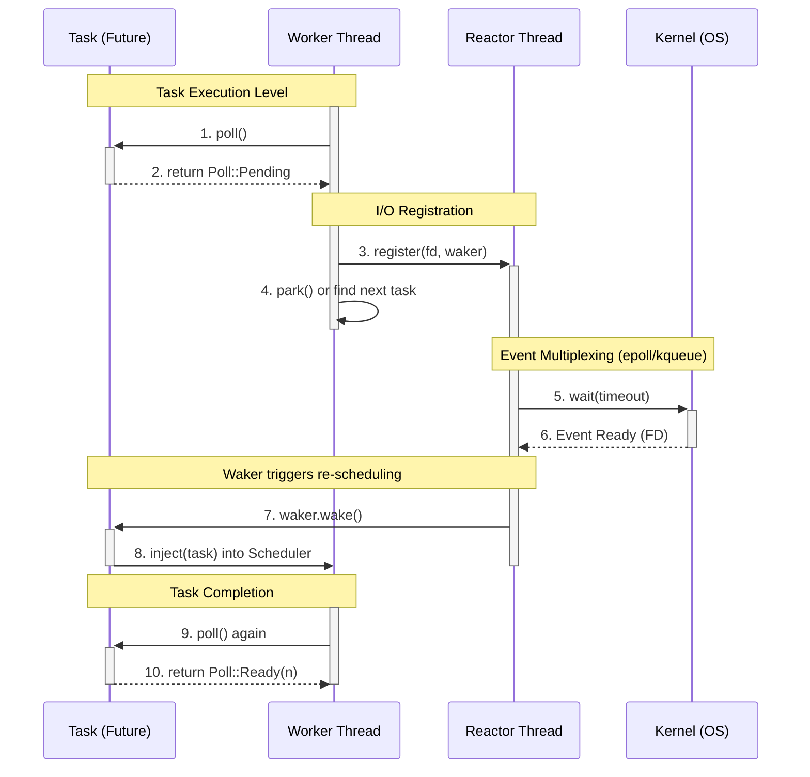
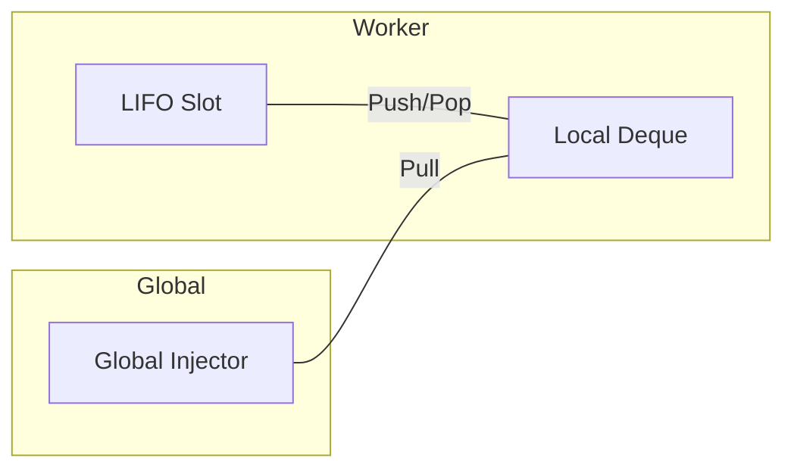
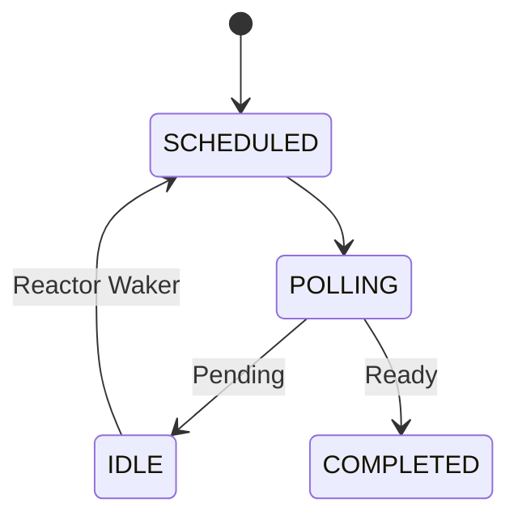

# Async Runtime

Implementation of a work-stealing asynchronous executor and reactor.

## Architecture

The system consists of a global scheduler, worker threads, and a single-threaded reactor.

### 1. Request Lifecycle

The following sequence documents the interaction between components during an asynchronous I/O operation (e.g., `TcpStream::read`).

### 2. Task Scheduling

Tasks are distributed via a multi-level queue hierarchy:
- **LIFO Slot**: Thread-local storage for the most recently woken task.
- **Local Deque**: Per-worker FIFO/LIFO queue.
- **Global Queue**: Shared injector for external tasks.

### 3. State Management

Task coordination is handled via an `AtomicU8` state machine.

## Performance Data

Measured using `cargo run --release` with 1024-byte payloads (MacOS).

| Concurrency | Total Messages | Runtime MiB/s | vs. Tokio MiB/s |
| :--- | :--- | :--- | :--- |
| **100** | 100,000 | 131.25 | 138.16 |
| **1,000** | 1,000,000 | 130.43 | 159.06 |
| **5,000** | 10,000,000 | 128.21 | 374.80 |

### Observed Scaling Bottlenecks
Beyond 1,000 concurrent connections, the throughput of the custom runtime remains constant while baseline Tokio continues to scale. This is attributed to:
- Serialized FD registration via a single `SegQueue`.
- Syscall overhead of the Reactor's notification mechanism.

## Request Lifecycle

The following sequence documents the interaction between components during an asynchronous I/O operation (e.g., `TcpStream::read`).

## Implementation Details

- **Memory**: Future allocation via Power-of-Two `SegQueue` buckets.
- **Timers**: Hashed wheel implementation for $O(1)$ timer management.
- **I/O**: Level-triggered multiplexing via the `polling` crate.
