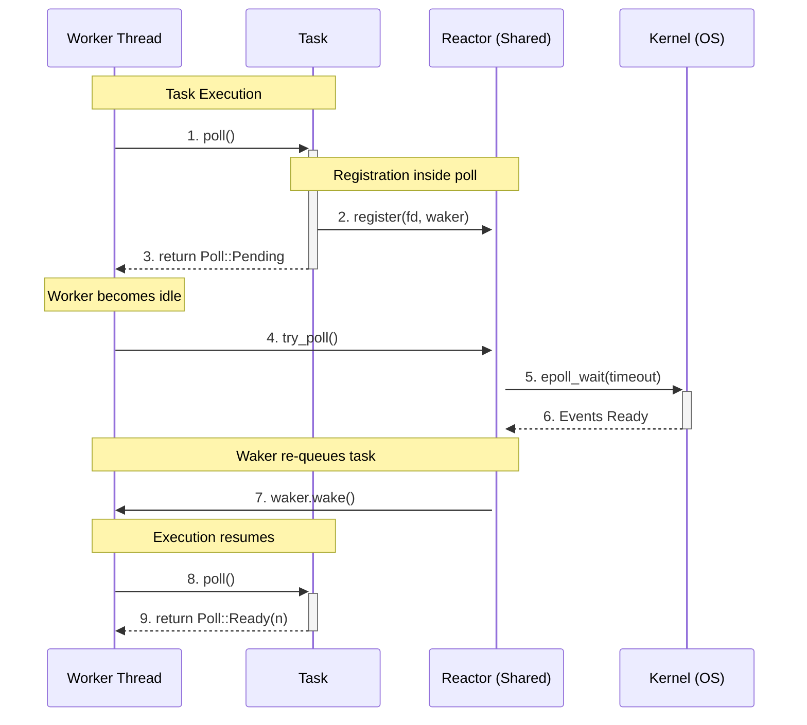

# Async Runtime

A minimal, high-performance asynchronous runtime in Rust implementing a work-stealing executor and epoll-based reactor. It provides significant performance gains over Tokio at 250 conncurent connections through a greedy scheduler that prioritizes cache locality, lock-free synchronization, and aggressive task recycling.

Async Rust blog post: [From Futures to Runtimes: How Async Rust Actually Works](https://dev.to/rosewrightdev/from-futures-to-runtimes-how-async-rust-actually-works-4gec)



## Performance Data
Taiga is optimized for low-latency, high-throughput workloads with moderate concurrency (100–1000 connections). Below is the median result of 100 runs comparing Taiga to Tokio.

```
Payload: 1024 bytes | Concurrency: 250 | Total: 1000000 msgs
┌──────────────┬────────────────┬───────────────┬────────────┐
│ Metric       ┆ Taiga Runtime  ┆ Tokio Runtime ┆ Rel. Stats │
╞══════════════╪════════════════╪═══════════════╪════════════╡
│ Total Time   ┆ 4.38s          ┆ 6.03s         ┆ -          │
├╌╌╌╌╌╌╌╌╌╌╌╌╌╌┼╌╌╌╌╌╌╌╌╌╌╌╌╌╌╌╌┼╌╌╌╌╌╌╌╌╌╌╌╌╌╌╌┼╌╌╌╌╌╌╌╌╌╌╌╌┤
│ Throughput   ┆ 223.00 MiB/s   ┆ 161.85 MiB/s  ┆ 1.38x      │
├╌╌╌╌╌╌╌╌╌╌╌╌╌╌┼╌╌╌╌╌╌╌╌╌╌╌╌╌╌╌╌┼╌╌╌╌╌╌╌╌╌╌╌╌╌╌╌┼╌╌╌╌╌╌╌╌╌╌╌╌┤
│ Message Rate ┆ 228347 msg/s   ┆ 165731 msg/s  ┆ 1.38x      │
├╌╌╌╌╌╌╌╌╌╌╌╌╌╌┼╌╌╌╌╌╌╌╌╌╌╌╌╌╌╌╌┼╌╌╌╌╌╌╌╌╌╌╌╌╌╌╌┼╌╌╌╌╌╌╌╌╌╌╌╌┤
│ Avg Latency  ┆ 1.084 ms       ┆ 1.499 ms      ┆ 1.38x      │
├╌╌╌╌╌╌╌╌╌╌╌╌╌╌┼╌╌╌╌╌╌╌╌╌╌╌╌╌╌╌╌┼╌╌╌╌╌╌╌╌╌╌╌╌╌╌╌┼╌╌╌╌╌╌╌╌╌╌╌╌┤
│ P50 Latency  ┆ 1080 µs        ┆ 1488 µs       ┆ 1.38x      │
├╌╌╌╌╌╌╌╌╌╌╌╌╌╌┼╌╌╌╌╌╌╌╌╌╌╌╌╌╌╌╌┼╌╌╌╌╌╌╌╌╌╌╌╌╌╌╌┼╌╌╌╌╌╌╌╌╌╌╌╌┤
│ P95 Latency  ┆ 1209 µs        ┆ 1743 µs       ┆ 1.44x      │
├╌╌╌╌╌╌╌╌╌╌╌╌╌╌┼╌╌╌╌╌╌╌╌╌╌╌╌╌╌╌╌┼╌╌╌╌╌╌╌╌╌╌╌╌╌╌╌┼╌╌╌╌╌╌╌╌╌╌╌╌┤
│ P99 Latency  ┆ 1388 µs        ┆ 1904 µs       ┆ 1.37x      │
├╌╌╌╌╌╌╌╌╌╌╌╌╌╌┼╌╌╌╌╌╌╌╌╌╌╌╌╌╌╌╌┼╌╌╌╌╌╌╌╌╌╌╌╌╌╌╌┼╌╌╌╌╌╌╌╌╌╌╌╌┤
│ Max Latency  ┆ 3787 µs        ┆ 4211 µs       ┆ 1.11x      │
└──────────────┴────────────────┴───────────────┴────────────┘
```

## Usage

The runtime includes a benchmarking tool to compare its performance against Tokio.

```bash
cargo run --release -- [concurrency] [total_messages] [payload_size] [flags]
```

### Arguments

| Argument | Description | Default |
| :--- | :--- | :--- |
| `concurrency` | Number of concurrent client connections | `50` |
| `total_messages` | Total number of messages to send across all clients | `10000` |
| `payload_size` | Size of each message payload in bytes | `65536` |

### Flags

| Flag | Shorthand | Description |
| :--- | :--- | :--- |
| `--runs` | `-r` | Number of benchmark runs to perform (reports median) |

### Example

To run a benchmark with 250 concurrent connections, 100,000 messages, and 1KB payloads over 10 runs:

```bash
cargo run --release -- 250 100000 1024 --runs 10
```
