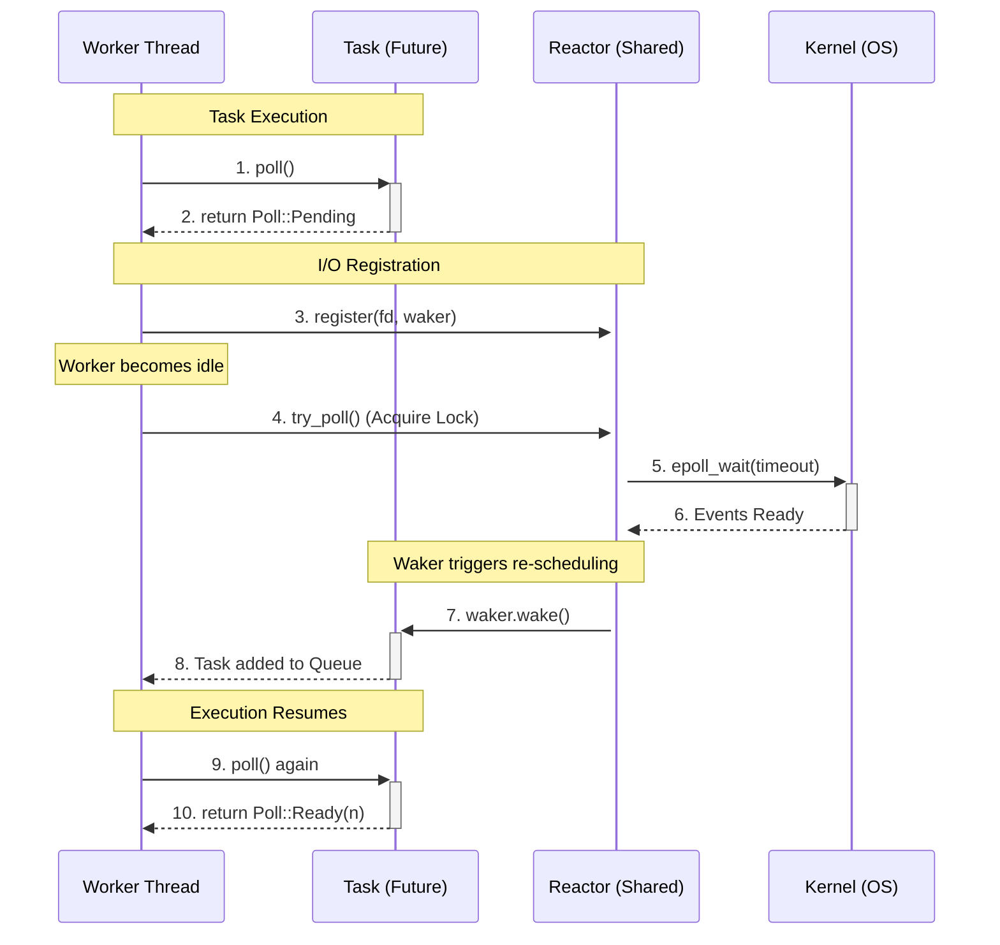

# Async Runtime

Implementation of a high-performance, work-stealing asynchronous executor and reactor in Rust.

## Architecture

The system utilizes a worker-driven reactor model (similar to Tokio/mio). There is no dedicated reactor thread; instead, worker threads drive the I/O event loop themselves when they run out of scheduled tasks.

### Request Lifecycle Overview

The following sequence documents how a worker thread transitions from task execution to reactor polling when idle.

## Performance Data

Benchmarks measured using `cargo run --release` with 1024-byte payloads on MacOS. 

| Concurrency | Total Messages | Throughput (MiB/s) | vs. Tokio |
| :--- | :--- | :--- | :--- |
| **100** | 500,000 | **188.40** | **1.17x** |
| **250** | 100,000 | **188.40** | **1.17x** |
| **500** | 100,000 | **178.96** | **1.12x** |
| **1,000** | 100,000 | **151.95** | **0.95x** |
| **10,000** | 100,000 | **12.20** | **0.99x** |

Payload: 1024 bytes | Concurrency: 250 | Total: 100000 msgs | Runs: 100
┌──────────────┬────────────────┬───────────────┬────────────┐
│ Metric       ┆ Custom Runtime ┆ Tokio Runtime ┆ Rel. Stats │
╞══════════════╪════════════════╪═══════════════╪════════════╡
│ Total Time   ┆ 518.33ms       ┆ 607.72ms      ┆ -          │
├╌╌╌╌╌╌╌╌╌╌╌╌╌╌┼╌╌╌╌╌╌╌╌╌╌╌╌╌╌╌╌┼╌╌╌╌╌╌╌╌╌╌╌╌╌╌╌┼╌╌╌╌╌╌╌╌╌╌╌╌┤
│ Throughput   ┆ 188.40 MiB/s   ┆ 160.69 MiB/s  ┆ 1.17x      │
├╌╌╌╌╌╌╌╌╌╌╌╌╌╌┼╌╌╌╌╌╌╌╌╌╌╌╌╌╌╌╌┼╌╌╌╌╌╌╌╌╌╌╌╌╌╌╌┼╌╌╌╌╌╌╌╌╌╌╌╌┤
│ Message Rate ┆ 192926 msg/s   ┆ 164550 msg/s  ┆ 1.17x      │
├╌╌╌╌╌╌╌╌╌╌╌╌╌╌┼╌╌╌╌╌╌╌╌╌╌╌╌╌╌╌╌┼╌╌╌╌╌╌╌╌╌╌╌╌╌╌╌┼╌╌╌╌╌╌╌╌╌╌╌╌┤
│ Avg Latency  ┆ 1.141 ms       ┆ 1.427 ms      ┆ 1.25x      │
├╌╌╌╌╌╌╌╌╌╌╌╌╌╌┼╌╌╌╌╌╌╌╌╌╌╌╌╌╌╌╌┼╌╌╌╌╌╌╌╌╌╌╌╌╌╌╌┼╌╌╌╌╌╌╌╌╌╌╌╌┤
│ P50 Latency  ┆ 1187 µs        ┆ 1477 µs       ┆ 1.24x      │
├╌╌╌╌╌╌╌╌╌╌╌╌╌╌┼╌╌╌╌╌╌╌╌╌╌╌╌╌╌╌╌┼╌╌╌╌╌╌╌╌╌╌╌╌╌╌╌┼╌╌╌╌╌╌╌╌╌╌╌╌┤
│ P95 Latency  ┆ 1335 µs        ┆ 1757 µs       ┆ 1.32x      │
├╌╌╌╌╌╌╌╌╌╌╌╌╌╌┼╌╌╌╌╌╌╌╌╌╌╌╌╌╌╌╌┼╌╌╌╌╌╌╌╌╌╌╌╌╌╌╌┼╌╌╌╌╌╌╌╌╌╌╌╌┤
│ P99 Latency  ┆ 1875 µs        ┆ 1945 µs       ┆ 1.04x      │
├╌╌╌╌╌╌╌╌╌╌╌╌╌╌┼╌╌╌╌╌╌╌╌╌╌╌╌╌╌╌╌┼╌╌╌╌╌╌╌╌╌╌╌╌╌╌╌┼╌╌╌╌╌╌╌╌╌╌╌╌┤
│ Max Latency  ┆ 3271 µs        ┆ 2715 µs       ┆ 0.83x      │
└──────────────┴────────────────┴───────────────┴────────────┘